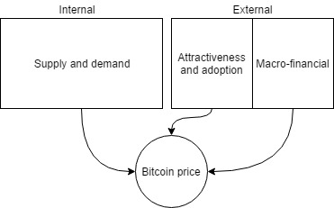

```{r setup, include=FALSE}
options(htmltools.dir.version = FALSE)
```

## Outline

1. Motivation
1. Thesis summary
1. Results of the first chapter
1. Results of the second chapter
1. Results of the three chapter
1. Conclusion

---
## Thesis contents

Chapter I - Exploring the dynamics of Bitcoin Price: A Bayesian Structural Time Series Approach.
> Elicits cryptocurrencies in light of economic minset. The approach includes a discussion about its "currency" denomination, nonetheless, is an exploratory study in general terms.

Chapter II - Investors’ biases and herding behavior in the cryptocurrency market.

> Posits behavioral economics principles to explain cryptocurrencies' price dynamics.

Chapter III - Attention, meta-information and behavioral convergence in cryptocurrency markets: A SVAR analysis
> Provide a conceptual framework to understand investing decision-making in cryptocurrency markets. Emphasize in three traits: attention-grabbing, behavioral convergence (herding) and response to uncertainty.

---
class: center, middle

## Chapter I - Exploring the dynamics of Bitcoin Price: A Bayesian Structural Time Series Approach.

---

### Objectives

+ Determine which are the drivers that explain Bitcoin's price between January 2013 and May 2017
+ Account for the heterogeneity of the interest over time for Bitcoin across countries

### Contribution

+ Time-varying coefficients
+ A geographic perspective of attraction based on multiple Google trends time series data
+ Bayesian variable selection of the drivers based on data-driven approach known as Spike and Slab

### Limitations

+ The cryptographic platform (Blockchain) where it works only let to make guesses about the drivers
+ Literature is limited
+ Limited computational power
    + It is needed up to 2.5gb of RAM per model object
    + Estimation can take several hours

---

## Background

- **What is Bitcoin?**: _"...it can be defined as a protocol, platform, currency or payment method"_ (Athey et al. 2016)
  - _... a set of technologies that established the framework to interchange money named bitcoins through a decentralized peer-to-peer network named Blockchain_ (Astonopoulos, 2014).

- _“...a commodity money without gold, fiat money without state, and credit money without debt” _(Bjerg, 2016).

- **What is an Altcoin?**: Stands for "alternative coin", refers to other digital/crypto-currencies different from Bitcoin

- There are more than **2100** different cryptocurrencies.

Problems?

+ _it lacks intrinsic value, long verification process of the transactions and high volatility._ (Yermack, 2013).

+ _Bitcoin is a speculative asset_ (Baek & Elbeck, 2014; Bartos, 2015; Bouoiyour & Selmi, 2016ab; Bouri et al, 2017; Dyhrberg, 2016, among others)

---
## Data

Target

- Bitcoin daily closing price

Internal factors

- USD exchange trade volume
- Median confirmation time for a block to be accepted
- Hash rate that measures the power of miner’s machines.
- Number of transactions excluding the 100 most popular addresses.

External factors

- Attractiveness
  - Google trends: Weekly search queries index for “bitcoin” from 27 different countries.
     - Varies across countries: Dynamic time warping dissimilarity algorithm
- Macro-financial
  - S\&P500 index: Indicator of the performance of a group of relevant stock market companies
  - Chicago Board Options Exchange (CBOE) Volatility Index (VIX)
  - Bearish sentiment from the AAII Investor Sentiment Survey
  - Gold’s price
  - Exchanges rate of the euro with the dollar (EURO-USD), dollar with the yuan (USD-YUAN)
---

## Methodology

> Structural time series (Space state model) consists of two equations: a measurement equation which links the observed variables to unobserved state variables and a transition equation which describes the dynamics of the state variables


&nbsp;

Observation/measurement equation:

$$
y_t=Z_t^T\alpha_t+\varepsilon_t \qquad \varepsilon_t \sim N(0, H_t)
$$

&nbsp;
Transition/state equation:
$$
\alpha_{t+1}=T_t\alpha_t+R_t\eta_t \qquad \eta_t \sim N(0, Q_t)
$$

&nbsp;

- $y_t$: vector of observations (observation vector)
- $\alpha_t$: unobserved vector (state vector)
- $Z_t,\, H_t,\,T_t,\, R_t, Q_t$: structural parameters' matrices
- $\varepsilon_t,\,\eta_t$: serially and mutually independent errors

---
class: middle

```{r, fig.cap="Time variant marginal posterior coefficient estimates for non-zero inclusion probability variables", echo=F, fig.align='center', out.width="70%"}

```

---

## Conclusions

&nbsp;
&nbsp;
&nbsp;
&nbsp;

- Search volume of Bitcoin is the strongest predictor of BTC's price
- Financial variables had little prediction power to explain BTC dynamics
- None of the internal factors have a relevant impact on the price

### Lines of future work
- **Is Bitcoin a currency or an asset?**
- **Is it a speculative bubble?**  

---
class: center, middle

## Chapter II - Investors’ biases and herding behavior in the cryptocurrency market.

---
### Objectives

1. Characterize the cryptocurrency markets from a behavioral economics perspective
--

1. Find commonalities with current evidence on investor's biases present in financial-like settings
--

1. Demonstrate that crypto-market suffers from fragility by testing herding behavior as a source of market instability

--

### Contribution
1. Literature relating behavioral economics and cryptocurrencies is barely existent yet
--

1. There ~~are~~ **were** no herding behavior works on this topic (up to the time it was published)

--

### Considerations
1. The ambiguity demands to assess certain assumptions
  1. For instance: irrationality is any deviation from the Efficient Market Hypothesis statements

---
## Background
### Currencies, investing or gambling?

.pull-left[
+ **Currency**:
    - Not used for transactions, besides:
      - Medium of exchange $\checkmark$
      - Unit of account $\checkmark$
      - Store of value $\times$
]

.pull-right[
- **Asset**

```{r, fig.cap="Components of a typical asset vs cryptocurrencies", echo=FALSE, out.width="80%"}
knitr::include_graphics("img/c2_crypto_elements.png")
```
]

---

### Searching for the parallelism: Efficient markets

- Current theoretical framework on financial economics assumes markets function **efficiently** <sup>1</sup>
--

- An efficient market is characterized by:
  - *Large numbers of rational, profit-maximizers and, actively competing individuals*
  - Current information is almost freely available to all participants
  - Actual prices reflect the effects of salient announcements
  - The actual price is a good estimate of assets' intrinsic value<sup>2</sup>
--

- EMH had an unprecedented impact on the economic theory and practice of modern financial economics
    
.footnote[
[1] Contemporaneous modern finance theory is based on the contribution of Eugene Fama, Stephen Ross, Robert Merton, Myron Scholes, William Sharpe, among others.

[2] Fundamental or intrinsic value is the true value of a stock-based business measured by the discounted cash flows of a firm.
]

---
### Searching for the parallelism: Behavioral economics

**Controversy:**

- By the late 1980s, there was a growing sense that some basic facts about financial markets were hard to reconcile with the traditional financial economics theory
--

- Shiller (1981) demonstrated that fluctuations in stock market prices are unlikely a result of a rational forecast of firms' future cash flows.
    - Several cases of "anomalies" were found
    - Speculative bubbles
      - Dot-com
      - Black Monday
--


- The existence of several speculative bubbles episodes stimulated the research on behavioral economics applications to finance
--

- An important finding of recent years is that many of the patterns we observe in the stock market are also present in other asset classes.
  - Real state
  - Long-term bonds
--


.center[**Maybe cryptocurrencies?**]

---

### Behavioral economics: The cryptocurrency case

- Any disclosure evoking a "new economy" will always be an allure for people eager for profits.
--


```{r, echo=F, fig.align='center', out.width="60%", fig.cap="Anatomy of bubbles"}

```


> Is a combination of two things people know the least: information technology and finance (not mine)

--

- Behavioral economists advocates insist on the argument that crashes are determined endogenously by investor's actions
    - Unexpected reactions
    - "Gut feeling"
    - Momentum investors 
--


- In [Poyser (2018)](https://link.springer.com/article/10.1007/s40822-018-0108-2) interest from the public had the highest prediction power
  - Social learning heuristics are intrinsic to crypto-markets
  - Crypto-investors' biases could be the reason for excessive volatility

---

### Behavioral economics: The cryptocurrency case
&nbsp;
&nbsp;
&nbsp;

.center[
**Can behavioral economics elucidate on the cryptocurrency puzzle?**

**Can we test for the existence of speculative bubbles in cryptocurrencies?**
]

--
 
Problems:

- Most of the tests are designed to identify abnormal deviations from fundamentals
- Fundamental valuation is arguably valid in cryptocurrencies
- Speculative bubbles can only be determined *ex-post*
--

&nbsp;
&nbsp;
&nbsp;
&nbsp;

.center[**Nonetheless, we can test if the system suffer from fragility**]


---

### Behavioral economics: The cryptocurrency case

Three essential group of biases that deserve special consideration to explain what happens in crypto-markets.

1. Optimism and overconfidence
1. Information processing
1. Herding behavior

---
### Herding behavior

**What is herding?**

+ Process that stems when someone **choose to ignore her private information and instead jump to the bandwagon by mimicking the actions of individuals who acted previously**<sup>1</sup>
--

- Herding or behavioral convergence entails the existence of a coordination mechanism (Devenow and Welch, 1996).
    - Coordination/transmission mechanism can be indirect or direct signals
      - Word-of-mouth, news and social media exposition, in-place observation, etc.
          - **First degree: Observe other's decision-makers**
          - **Second degree: Price movements**
          
--

**What is the deal with it?**

- <span style="color:blue">Herding behavior is a strong violation of the EMH</span>
--

- <span style="color:blue">Decision-makers actions are assumed to be uncorrelated according to the EMH</span>

.footnote[
[1] See Banerjee, 1992; Bikhchandani; Kumar & Goyal, 2015; Hirshleifer and Welch, 1992; Graham, 1999.
]

---

### Herding behavior in crypto-markets

**Characteristics:**

+ Social judgment is intrinsic to the cryptocurrency market since the valuation of any currency is contingent to the extension of the group that founds it valuable.
--

+ Shapiro & Varian (1999, 2004) stated that **old economy** differentiates from the **new economy** in the **substitution of economies of scale by the economics of networks**
--

+ It is profitable to achieve the interest of a critical mass of users/investors that yield a higher market capitalization.
--

+ De Long et al. (1990)  **noise trader**<sup>1</sup> **misperceive expected returns** and **generate beliefs and heuristics to buy and sell following a simple feedback rule** -> <span style="color:blue"> **Volatility** </span>
--

+ Scharfstein and Stein (1990) stated that within individual investment environments, **managers usually disregard private information by adopting a follow-the-crowd strategy**
--

+ **Limits of attention** increase the probability of herding due to the difficulty to accurately process information (Hirshleifer and Hong Teoh, 2003).
--

+ Welch (2000) found that **analysts herd in their stock recommendations**, exposing **significant positive correlation between adjacent analysts**
--

+ Bikhchandani, Hirshleifer and Welch (1992) proved that herding <span style="color:blue">**explain conformity, fads, fashions, booms, and crashes**</span>

.footnote[
[1] Represents the irrational alter ego of the sophisticated investors. Opposite of Information (Black, 1986)

[2] There are several works on investor trading, managerial investment, financing choices, analyst following and forecasts, market prices, market regulation, bank runs, bubbles, and welfare (see Hirshleifer and Hong Teoh, 2003; Brunnermeier and Oehmke, 2013,  Grossman and Stiglitz; 1976)
]

---
### Herding

**What is the relationship between herding and speculative bubbles?**

+ Sheds light on the fragility of the system in face of extreme price movements
--

+ Herding solely could not explain the presence of speculative bubbles, but it provides information about **crypto-market conformity dynamics** that entails **fragility** and **bubble susceptible** behavior
--


.center[**Can herding be measured through prices?**]
--

&nbsp;
&nbsp;
&nbsp;

.center[R/ Test for empirical herding are by construction imperfect but some approximation can be done]

---

## Data

+ Last cut showed that there were 1557 different cryptocurrencies available in the market
+ This study dampens the sample to the first 100 leading ones which in aggregated terms account for nearly 96% of total cryptocurrency’s (CC) market capitalization.
+ Data was scraped from [www.coinmarketcap.com]("www.coinmarketcap.com") website
+ Range of date varies between cryptocurrencies From 2013-04-01 to 2018-04-15
+ No distinction over categories

$$
\begin{align}
R_{c,t}=\frac{CP_{t}-CP_{t-1}}{CP_{t-1}}
\end{align}
$$

&nbsp;

$R_{c,t}$: Market returns for the cryptocurrency $c$  
$CP_t$: Closing prices for time $t$

---

## Methodology

Empirical test based on absolute dispersion:

$$
\begin{align}
CSAD_t=\frac{\sum_{i=1}^n \left | R_{c,t}-\bar{R}_{m,t} \right |}{N}
\end{align}
$$

+ $CSAD_t$: Cross Sectional Absolute Deviations of Returns for time $t$  
+ $\bar{R}_{m,t}$: Cross Sectional **Median** Return for crypto-market portfolio $m$ across time $t$

+ Solves the problem of subjective assign of thresholds
+ Less sensitive to outliers


- Basic idea: **if market participants tend to follow the consensus and ignore their own priors during periods of large price movements, then the linear and increasing relation between dispersion and market return will no longer hold**
--

- The relation can become non-linearly increasing (adverse herding) or even decreasing (herding)

---
### Specification to test herding behavior under asymmetric states

$$
\begin{matrix}
CSAD_{t,1}=\gamma_{0,1}+\gamma_{1,1} D\times \left|R_{m,t}\right|+\gamma_{2,1} (1-D)\times \left|R_{m,t}\right|+ \\
\qquad \qquad D\times\gamma_{3,1} R_{m,t}^2+\gamma_{4,1} (1-D)\times R_{m,t}^2+\gamma_{4+k,1}CSAD_{t-k,1}+\varepsilon_{t,1} & S_t=1\\
CSAD_{t,2}=\gamma_{0,1}+\gamma_{1,2} D\times \left|R_{m,t}\right|+\gamma_{2,2} (1-D)\times \left|R_{m,t}\right|+ \\
\qquad \qquad D\times\gamma_{3,2} R_{m,t}^2+\gamma_{4,2} (1-D)\times R_{m,t}^2+\gamma_{4+k,2}CSAD_{t-k,2}+\varepsilon_{t,2} & S_t=2\\
 \vdots & \vdots \\
CSAD_{t,i}=\gamma_{0,i}+\gamma_{1,i} D\times \left|R_{m,t}\right|+\gamma_{2,i} (1-D)\times \left|R_{m,t}\right|+ \\
\qquad \qquad D\times\gamma_{3,i} R_{m,t}^2+\gamma_{4,i} (1-D)\times R_{m,t}^2+\gamma_{4+k,i}CSAD_{t-k,i}+\varepsilon_{t,i} & S_t=i\\
\end{matrix}
$$
with:
$\varepsilon_{t,i} \sim N(0,\sigma_{i}^2) \  for \ i=1,...,n$

+ Parameters $\gamma_r \  \ for\ \ r=1,...,4+k$ and $\sigma^2_s$ will be allowed to change
+ The model employed Newey and West (1987) variance estimator to produce consistent standard errors in the presence of autocorrelation and heteroscedasticity.
+ The number of "regimes" is chosen given Akaike Information Criteria (AIC)
+ Subjectivity exist into presenting an equilibrium between descriptive power and interpretability

---
#### Results | Herding under symmetric conditions

```{r, echo=FALSE, fig.align='center', out.width="50%"}

```

```{r, echo=FALSE, fig.align='center', out.width="50%", fig.cap="Regime switching smoothed probabilities and estimates under symmetric herding behavior"}

```

---
#### Results | Herding under asymmetric conditions

```{r, echo=FALSE, out.width="70%", fig.align='center'}

```

```{r, echo=FALSE, out.width="50%", fig.align='center', fig.cap="Behavior Regime switching smoothed probabilities and estimates under asymmetric herding behavior"}

```

---

## Conclusion

- This study examined herding behavior within the crypto-markets
--

- Behavioral economics provides seemly suitable insights to explain the crypto-market price dynamics
--

- Crypto-investors frequently follow the consensus under market stress situations.
--

- Under different market conditions, herding has been evidenced in increasing returns scenarios, while in decreasing periods the evidence was not overwhelming (HODL can be an actual strategy).
--

- Herding has been intensifying since 2016 and it got stronger during the last months of 2017. The boost of herding entails market fragility, this **could** be the reason that recently Bitcoin plummet under $4000.
--

- A market as an ambiguous as the cryptocurrencies is chaotic by construction (economically wise), without any guide that determines an objective valuation that anchors informed expectations, it is impossible to coordinate a large sum of bias-prone individuals. **Trust may not be enough.**

---
class: center, middle

## Chapter III - Attention, meta-information and behavioral convergence in cryptocurrency markets: A SVAR analysis

---

## Objectives

1. Integrate the insights from the 2 previous chapters.
1. Propose a proxy to measure behavioral convergency in the cryptocurrency market.
1. Approximate a causal interpretation on the relationship across the relevant elements of cryptomarket system.

### Background

1. Human beings have limited computational resources to undertake a decision-making task.
1. Anomalies are far more common in cryptomarkets than in financial environments.
1. Searching problem is solved by investing in attention-grabbing stocks.
  1. Abnormal trading volume.
  1. Extreme one day returns.
1. Bitcoin plays a dual role, first it is an amalgam of a currency and an asset, and secondly as a meta-informational input to convey trust to the entire "cryptomarket".
  1. Trust is a proxy for loss-aversions
1. cues $\rightarrow$ reaction $\rightarrow$ strategy $\rightarrow$ cues 

---

### Results | Shock from Bitcoin

```{r, echo = FALSE, fig.cap="Cumulative IRF effect from Bitcoin's returns (BTC) to the rest of the variables in the system", out.width="70%", fig.align='center'}

```

---
### Results | Shock from attention

```{r, echo = FALSE, fig.align='center', out.width="70%", fig.cap="Cumulative IRF effect from attention (ATT) to the rest of the variables in the system"}

```

---
### Results | Shock from uncertainty

```{r, echo = FALSE, fig.align='center', out.width="70%", fig.cap="Cumulative IRF effect from uncertainty (BTCv) to the rest of the variables in the system"}

```

---
### Results | Shock from herding index under decreasing states

```{r, echo = FALSE, fig.cap="Cumulative IRF effect from herding index under decreasing states (HIND) to the rest of the variables in the system", fig.align='center', out.width="70%"}

```

---
### Results | Shock from herding index under increasing states

```{r, echo = FALSE, fig.cap="Cumulative IRF effect from herding index under decreasing states (HINU) to the rest of the variables in the system", fig.align='center', out.width="70%"}

```

---

## Conclusion


---
class: center, middle, inverse

# Appendix


---

## Chapter I

.pull-left[
```{r, echo=F, fig.align="center", fig.cap="Group of drivers", out.width="100%"}

```
]

.pull-right[
```{r, echo=F, fig.align="center", fig.cap="Clustered GSI by country", out.width="100%"}

```
]


## Chapter II

---
class: center, middle

```{r, fig.cap="Cryto-market: Median, Squared CSAD returns", echo=F, out.width="50%"}

```

---

### Optimism and overconfidence <sup>1</sup>

+ People exhibit exacerbated trust on their own ability, knowledge, and skills
--

+ Self-reliance on personal judgments entails
    - miscalibration  
    - over-precision  
    - optimism  
    - and overreaction to random events
--

- Examples:
    - **90% of Swedish car drivers considered themselves better than the median driver** (Svenson, 1981).
    - People fail to assign probabilities and calibrate unexpected events. 
        - When asked for 1% and 99% tails for inflation and exchange rates, the results found experts had **20% rate of "surprise" instead of the expected 2%** (Alpert & Raiffa, 1982)

.footnote[
[1] See Barber and Odean 2013; Kahneman and Riepe, 1998; Barberis and Thaler, 2002; Alpert and Raiffa, 1982]
---

### Optimism and overconfidence

+ Crypto-investors can easily be overconfident of their capacity to invest in a market characterized by increasing trend and high returns
--

+ Random events in one cryptocurrency are interpreted and extrapolated to other altcoins, **this might be the reason several cryptocurrencies are correlated**

--

    
.center[
```{r, fig.cap="Interpretation to random events", echo=FALSE, out.width="70%"}

```
]

---

### Information, interest, and social wisdom

> “A wealth of information creates a poverty of attention” (H. Simon)

.center[
```{r, fig.cap="Bitcoin price vs Google Search Index for \"Bitcoin\" interest", echo=FALSE, out.width="70%"}

```
]

---

### Information, public interest, and social wisdom

#### Characteristics:
- In the information era, there is an **overload of data** that demands the creation of mechanisms to discern **which information is relevant and which is not.**
--

- Humans have **limited computational capabilities** hence, the formation of **rules of thumb** usually takes place instead of coherent/rational reasoning according to each problem (see Bounded Rationality)
--

- Cryptocurrencies' information is based on fairly diversified sources
    - Whitepapers
    - News, project websites, blogs, and social media.
    - Presumed cryptocurrency’s experts declare higher prices predictions (anchoring prospects)
--
- Reddit: Online forums
    - The largest community on the Internet, with more than 600.000 subscribers
    - Advice to buy and sell
    - Investment in new altercoins
    - Price pattern recognition
---

#### Information, public interest, and social wisdom

- News media have incentives to broadcast hypes with the purpose of capturing the reader’s attention towards different issues, being crypto-markets one of many of them.
--

- Specialized websites offer "social investing", that is, a system that automatically copies trades done by **experienced, professional and successful investors.**
    - Paying a "success fee" as a reward
    - <span style="color:blue">Following others’ actions is precisely a clear contradiction to what EMH states about random investors’ decisions.</span>

.center[
```{r, echo=F}

```
]

---

#### Information, public interest, and social wisdom

**Hypothesis?**

- An active agent in the crypto marketplace may face:
    - Uncertainty and inability to assess probabilities of events  
    - Problems to decide accurately  
    - Limitations to assess the degree of quality of announcements
--
- **Is it possible to catch up with 2K+ cryptocurrencies and ~40 new ones per month?**<sup>1</sup>
    - In my opinion: **hardly**. <span style="color:blue">Especially in the task of distinguishing between fake and true potential projects.</span>
--

> Once people receive information, they have to discern if it is accurate or not, **but prices often react faster**, then, it is strategically convenient to **follow what others do**, but because it is unobserved, there are incentives to rely only on **price dynamics**.

[1] Almost 2100 by the first week of December 2018.

---
class: center, middle

**"The less information you have, the stronger is your incentive to follow the consensus." (Graham, 1999)**

---

### Model: Herding behavior

An empirical test based on absolute dispersion:

&nbsp;
&nbsp;


$$
\begin{split}
CSAD_t=\gamma_0+\gamma_1\left|R_{m,t}\right|+ \gamma_2 R_{m,t}^2 + \gamma_{2+k}CSAD_{t-k}+\varepsilon_t
\end{split}
$$

&nbsp;

with:  
$\varepsilon_t \sim N(0,\sigma^2)$  

+ $\gamma_1$ captures the linear relationship between dispersion and market returns  
+ $\gamma_2$ captures herding with $\gamma_2<0$ and adverse herding for $\gamma_2>0$  
+ $k$: AR(k) to dismiss lagged effects

+ The baseline in this model will be a rational model of asset returns, that is, a scenario in which crypto-investors do not follow the consensus.

---
### Model: Herding behavior under asymmetric market states

An empirical test based on absolute dispersion:

&nbsp;


$$
\begin{split}
CSAD_t=\gamma_0+\gamma_1 D\times \left|R_{m,t}\right|+\gamma_2 (1-D)\times \left|R_{m,t}\right|+D\times\gamma_3 R_{m,t}^2+\gamma_4 (1-D)\times R_{m,t}^2+\gamma_{4+k}CSAD_{t-k}+\varepsilon_t
\end{split}
$$

&nbsp;

with:  
$\varepsilon_t \sim N(0,\sigma^2)$  

+ $D=1$: if $R_{m,t}<0$  
+ $D=0$: if $R_{m,t}>=0$  
+ $k$: AR(k) to dismiss lagged effects  

---
### Model: Markov Regime-Switching model for herding behavior

A two-state MC can be described as:

$P(S_t=j|S_{t-1}=i, S_{t-2}=b, ..., \Omega_{t-l})=P(S_t=j|S_{t-1}=i)=P_{ij}$

where:
$p_{ij}$ transition probability of being at $j$ will only depend on the previous state $i$, $S_t$ is not observed, but it can be inferred from observed data. And, $\Omega$ represent all the parameters necessary to describe the Data Generating Process (DGP)

- MS captures shifts in behavior which are not observable for instance the appearance of interventions or forcing variables.
--

- High-frequency data exhibits structural changes in their behavior associated with observed and unobserved events.
--

- It is expected that herding display dynamics that are regime dependent
    - Adverse herding vs herding
    - Intensity of herding
--
- Herding behavior states are (likely):
    - Unobserved
    - Probabilistic